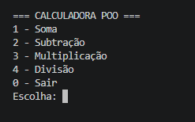

# 🧮 Calculadora em Java

Aplicação de calculadora desenvolvida em Java, utilizando programação orientada a objetos (POO) e execução via console.

---

## 🚀 Funcionalidades

- ➕ Soma
- ➖ Subtração
- ✖️ Multiplicação
- ➗ Divisão
- ⚠️ Tratamento de erro (divisão por zero)

---

## 🛠️ Tecnologias utilizadas

- Java
- Programação Orientada a Objetos (POO)

---

## 📷 Demonstração



---

## ▶️ Como executar o projeto

```bash
# Compilar
javac Main.java Calculadora.java

# Executar
java Main
